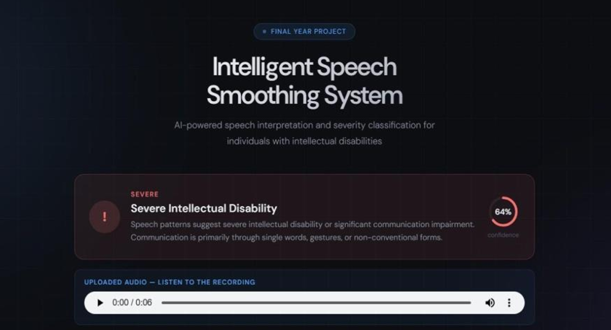
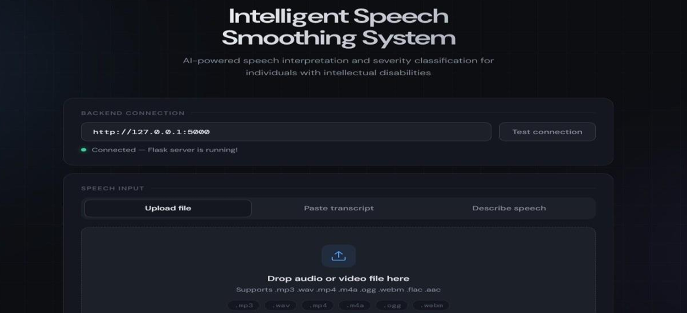
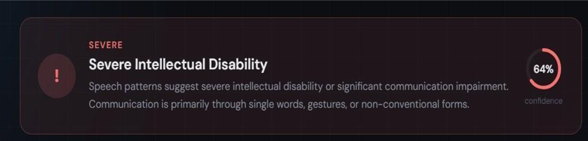
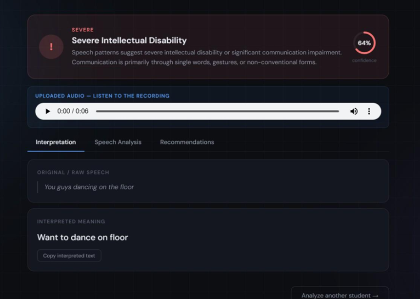

<div align="center">

# 🧠 Intelligent Speech Cluttering Analyzer and Smoother

### AI-Powered Speech Analysis & Severity Detection System for Speech Disorders


**An AI-powered web application that analyzes cluttered speech, predicts speech severity, and supports speech assessment using machine learning and speech signal processing.**

</div>

---

# 📖 Table of Contents

- Overview
- Problem Statement
- Features
- System Architecture
- Workflow
- Technology Stack
- Project Structure
- Installation
- Usage
- Machine Learning Pipeline
- Results
- Future Enhancements
- Screenshots
- Demo
- Author

---

# 📌 Overview

Speech cluttering is a fluency disorder characterized by rapid, irregular, and unclear speech that makes communication difficult.

This project presents an intelligent speech analysis system capable of:

- Processing speech recordings
- Extracting acoustic features
- Predicting cluttering severity
- Providing interpretable speech analysis
- Supporting speech therapy applications

The application combines Machine Learning, Speech Signal Processing, and Web Technologies to create an end-to-end speech assessment platform.

---

# ❗ Problem Statement

Traditional speech assessment relies heavily on speech-language pathologists and manual evaluation.

This process can be:

- Time-consuming
- Subjective
- Expensive
- Difficult to access in remote areas

The objective of this project is to automate speech severity detection using machine learning, enabling faster and more consistent speech assessment.

---

# ✨ Features

- 🎤 Upload speech recordings
- 🔊 Audio preprocessing
- 📈 Noise reduction
- 🎯 Speech feature extraction
- 🧠 Speech severity prediction
- 📊 Machine Learning classification
- 📄 Transcript lookup
- 🌐 Flask-based web application
- 📱 User-friendly interface
- ⚡ REST API architecture

---

# 🏗️ System Architecture

```
Speech Audio
      │
      ▼
Audio Upload
      │
      ▼
Preprocessing
      │
      ▼
Noise Removal
      │
      ▼
Feature Extraction
(MFCC, Pitch, Energy)
      │
      ▼
Machine Learning Model
(Random Forest / SVM)
      │
      ▼
Severity Prediction
      │
      ▼
Result Visualization
```

---

# ⚙️ Workflow

1. User uploads a speech recording.
2. Audio is preprocessed.
3. Noise is removed.
4. Acoustic features are extracted.
5. Feature vectors are generated.
6. Machine Learning model predicts severity.
7. Results are displayed through the web interface.

---

# 🧠 Machine Learning Pipeline

### Audio Processing

- Noise Reduction
- Silence Removal
- Normalization

### Feature Extraction

- MFCC
- Pitch
- Energy
- Speech Rate
- Zero Crossing Rate

### Machine Learning

- Random Forest
- Support Vector Machine (SVM)

### Output

The system predicts one of the following severity levels:

- ✅ Normal
- 🟢 Mild
- 🟡 Moderate
- 🔴 Severe

---

# 🛠️ Technology Stack

## Programming

- Python

## Machine Learning

- Scikit-Learn
- TensorFlow

## Audio Processing

- Librosa
- NumPy
- Pandas

## Backend

- Flask

## Frontend

- HTML
- CSS
- JavaScript

## Development Tools

- Git
- GitHub
- VS Code

---

# 📂 Project Structure

```
api/
core/
data/
data_pipeline/
models/
utils/

app.py
config.py
requirements.txt
README.md
```

---

# 🚀 Installation

Clone the repository

```bash
git clone https://github.com/Municharmi/Intelligent-speech-smoothing-.git
```

Move into the project

```bash
cd Intelligent-speech-smoothing-
```

Install dependencies

```bash
pip install -r requirements.txt
```

Run the application

```bash
python app.py
```

---

# 💻 Usage

1. Launch the Flask application.

2. Upload a speech recording.

3. Wait for preprocessing.

4. The model extracts speech features.

5. Machine Learning predicts severity.

6. View the prediction and speech analysis.

---

# 📊 Results

The implemented system is capable of:

- Processing uploaded speech recordings
- Extracting meaningful acoustic features
- Predicting speech severity
- Displaying results through an interactive web interface
- Supporting speech assessment with an automated workflow

---

# 📷 Application Screenshots

## 🏠 Home Page



---

## 🎤 Audio Upload and Processing



---

## 📊 Speech Severity Classification



---

## 💬 Speech Interpretation



# 🎥 Demo

**Coming Soon**

A complete walkthrough of the application will be added.

---

# 🔮 Future Enhancements

- Real-time speech analysis
- Deep learning-based severity prediction
- Speech smoothing using generative AI
- Cloud deployment
- Mobile application
- Multilingual speech support
- Advanced analytics dashboard

---

# 👨‍💻 Skills Demonstrated

- Machine Learning
- Speech Processing
- Audio Feature Engineering
- Flask Development
- REST APIs
- Signal Processing
- Model Deployment
- Python Programming
- Software Engineering
- Git & GitHub

---

# 👩‍💻 Author

## Muni Charmi Thaniganti

GitHub:
https://github.com/Municharmi

---

# ⭐ Support

If you found this project useful, consider giving it a ⭐ on GitHub.

It helps others discover the project and supports future improvements.

---

# 📜 License

This project is intended for educational and research purposes.
